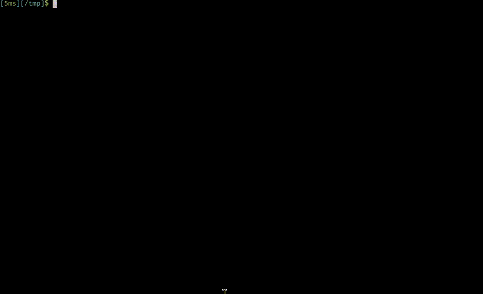

# MicroVM.nix

<p align="center">
  <strong>Handbook:</strong>
  <a href="https://astro.github.io/microvm.nix/">HTML</a>
  <a href="doc/src/SUMMARY.md">Markdown</a>
  •
  <strong><a href="https://matrix.to/#/#microvm.nix:envs.net">Matrix chat</a></strong>
  •
  <strong><a href="./CHANGELOG.md">Changelog</a></strong>
  •
  <strong><a href="https://github.com/sponsors/astro">Support the project</a></strong>
</p>
<p align="center">
  
</p>

A Nix Flake to build NixOS and run it on one of several Type-2
Hypervisors on NixOS/Linux. The project is intended to provide a more
isolated alternative to `nixos-container`. You can either build and
run MicroVMs like Nix packages, or alternatively install them as
systemd services declaratively in your host's Nix Flake or
imperatively with the provided `microvm` command.

[Project Presentation (video)](https://media.ccc.de/v/nixcon-2023-34861-microvm-nix)

## At a glance

- MicroVMs are Virtual Machines but use special device interfaces
  (virtio) for high performance.
- This project runs them on NixOS hosts.
- You can choose one of five hypervisors for each MicroVM.
- MicroVMs have a fixed RAM allocation (default: 512 MB) but can be
  shrunk using `microvm-balloon`
- MicroVMs have a read-only root disk with either a prepopulated
  `/nix/store` or by mounting the host's along with an optional
  writable overlay. This filesystem can be built as either *squashfs*
  (smaller) or *erofs* (faster).
- You define your MicroVMs in a Nix Flake's `nixosConfigurations`
  section, reusing the `nixosModules` that are exported by this Flake.
- MicroVMs can access stateful filesystems either on a image volume as
  a block device, or alternatively as a shared directory hierarchy
  through *9p* or *virtiofs*.
- Zero, one, or more virtual tap ethernet network interfaces can be
  attached to a MicroVM. `qemu` and `kvmtool` also support *user*
  networking which requires no additional setup on the host.

## Hypervisors

| Hypervisor                                                              | Language | Restrictions                             |
|-------------------------------------------------------------------------|----------|------------------------------------------|
| [qemu](https://www.qemu.org/)                                           | C        |                                          |
| [cloud-hypervisor](https://www.cloudhypervisor.org/)                    | Rust     | no 9p shares                             |
| [firecracker](https://firecracker-microvm.github.io/)                   | Rust     | no 9p/virtiofs shares                    |
| [crosvm](https://chromium.googlesource.com/chromiumos/platform/crosvm/) | Rust     | 9p shares broken                         |
| [kvmtool](https://github.com/kvmtool/kvmtool)                           | C        | no virtiofs shares, no control socket    |
| [stratovirt](https://github.com/openeuler-mirror/stratovirt)            | Rust     | no 9p/virtiofs shares, no control socket |
| [alioth](https://github.com/google/alioth)                              | Rust     | no virtiofs shares, no control socket    |


## Installation

```shell
nix registry add microvm github:astro/microvm.nix
```

(If you do not want to inflict this change on your system, just
replace `microvm` with `github:astro/microvm.nix` in the following
examples.)

## Start writing your own NixOS MicroVM definitions

```shell
nix flake init -t microvm
$EDITOR flake.nix
nix run .#my-microvm
```

## Examples

### Run MicroVMs on your local machine

```shell
nix run microvm#qemu-example
nix run microvm#firecracker-example
nix run microvm#cloud-hypervisor-example
nix run microvm#crosvm-example
nix run microvm#kvmtool-example
nix run microvm#stratovirt-example
```

### Run a MicroVM example with nested MicroVMs on 5 different Hypervisors

```shell
nix run microvm#vm
```

Check `networkctl status virbr0` for the DHCP leases of the nested
MicroVMs. They listen for ssh with an empty root password.

### Experimental: run graphical applications in cloud-hypervisor with Wayland forwarding

```shell
nix run microvm#graphics neverball
```

## Commercial support

Accelerate your operations and secure your infrastructure with support
from the maker of microvm.nix and a team of virtualization
experts. Contact Cyberus Technology: <https://www.cyberus-technology.de/contact>

---

Looking for help or customization?

Get in touch with Numtide to get a quote. We make it easy for companies to
work with Open Source projects: <https://numtide.com/contact>
